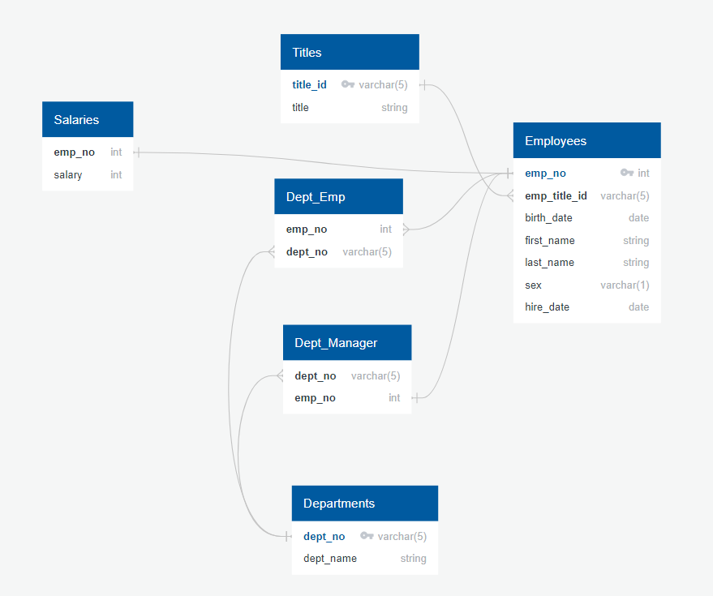

# SQL Challenge

## Data Modeling

The following image is my Entity Relationship Diagram (ERD) of the tables:

## Data Engineering

The following file contains the SQL code I used to create the table schema: 

[Schema](solution/schema.sql)

## Data Analysis

The following file contains the SQL queries I used to conduct the analysis as listed in the instructions: 

[Queries](solution/analysis.sql)